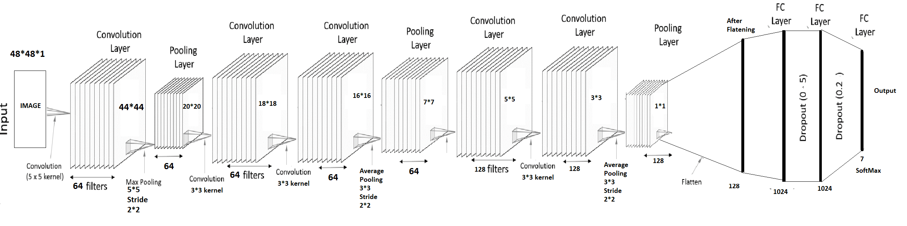

# ML Mini Project
Machine Learning project consisting of three modules
1. Implementation of a supervised learning algorithm (Logistic regression) from scratch using 
2. Implementation of an unsupervised learning algorithm (k-Nearest-Neighrbours) from scratch using python
3. Implementation of a paper written by students at Stanford for implementation 

Facial Emotion Recognition: We used Deep learning aproch for classifying given face into 7 emotions. 
Dataset can be downloaded from https://www.kaggle.com/c/challenges-in-representation-learning-facial-expression-recognition-challenge/data 

